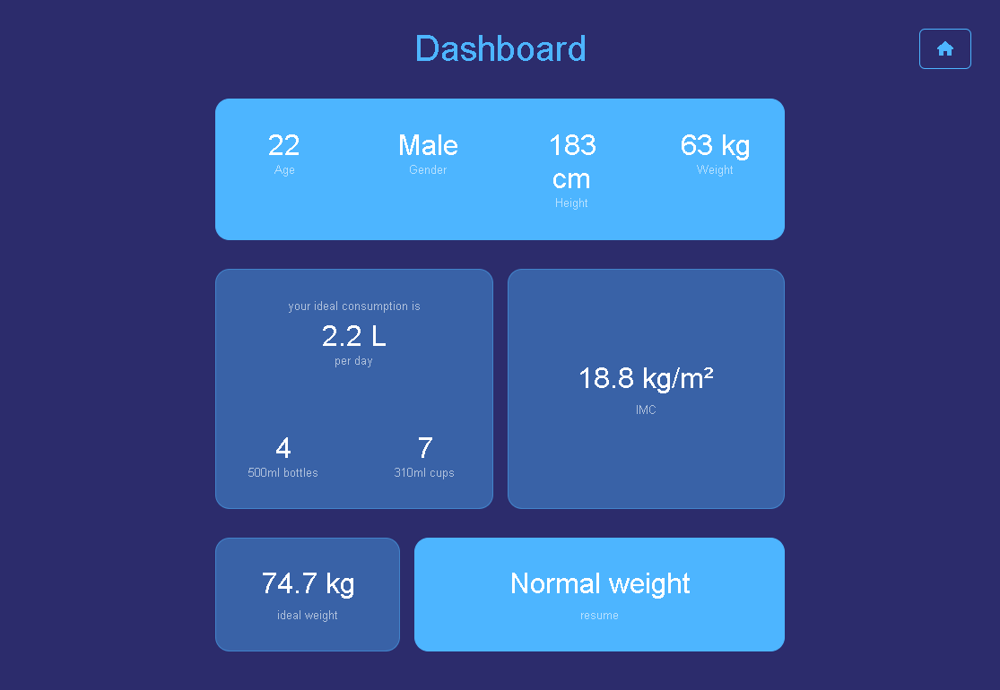

<h1 align="center">HealthByWeight</h1>
<p align="center">Calculate your health by weight</p>

<p align="center">
    <a href="#about">About</a> |
    <a href="#features">Features</a> |
    <a href="#technologies">Technologies</a> |
    <a href="#requirements">Requirements</a> | 
    <a href="#demo">Demo</a> 
    
</p>





<br>

# About
<p>
    By age, gender, height and weight, the "HealthByWeight" will calculate
        • Ideal consumption of water per day
        • IMC
        • Ideal weight
        • Weight situation.
</p>

# Features
- [x] Ideal consumption of water per day
- [x] IMC
- [x] Ideal weight
- [x] Weight situation.


# Technologies
- Javascript
- HTML
- CSS

# Requirements
- [Source code editor](https://code.visualstudio.com/)
- For better performance the minimum requirements for programming include: 
    - Intel Core i5 or i7 processor. 
    - Full HD resolution, ideally 1920×1080. 
    - 8GB of RAM.

# Demo

You can access the demo of this project at :
```bash 
https://healthbyweight.vercel.app
```

---
Made with 💜 by Vítor Conceição ▶ [See my LinkdIn](https://www.linkedin.com/in/v%C3%ADtor-concei%C3%A7%C3%A3o-707404227/)